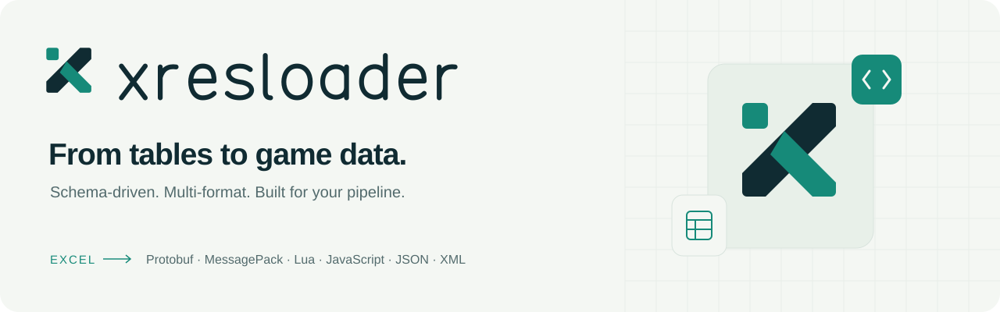

# xresloader 视觉资源

打开 [index.html](index.html) 查看完整资源、明暗主题及图标实际尺寸。本地双击即可使用，无需安装依赖或启动服务。GitHub 中的 HTML 链接显示源码；下载仓库后用浏览器打开。



## 设计

以「单元格 → 结构化数据」为主题：独立的方格代表表格数据，两条交汇的带状路径构成模块化 X。图标减少细节，适用于浏览器标签、项目头像与文档导航；独立绘制的小写几何字标保持工具项目的亲和感。

深墨色提供清晰轮廓，青绿色表达转换，薄荷绿用于深色背景上的强调，暖白色用于浅色底。立体插画延续相同的单元格与数据模块元素。

## 文件清单

所有路径相对于本目录。下表的“浅色 / 深色”指**使用背景**。

| 资源 | 文件 | 尺寸 / 用途 |
| --- | --- | --- |
| 独立标志 | `mark.svg`、`mark-inverse.svg` | 128 × 128，浅色 / 深色背景，透明底 |
| 单色标志 | `mark-mono.svg` | 128 × 128，使用 `currentColor`，适合印刷或内联 SVG |
| 完整字标 | `logo-light.svg`、`logo-dark.svg` | 530 × 128，透明底，字形为路径 |
| 字标位图 | `logo-light.png`、`logo-dark.png` | 1060 × 256，透明底，适合演示文稿 |
| 主图标 | `icon.svg` | 128 × 128，深墨色圆角底 |
| 图标位图 | `icon-{16,32,48,192,256,512,1024}.png` | 对应像素尺寸；每个尺寸独立从 SVG 渲染 |
| 浏览器图标 | `favicon.svg`、`favicon.ico` | ICO 包含 16、32、48、256 像素四个图层 |
| Apple touch 图标 | `apple-touch-icon.png` | 180 × 180，不透明方形底，圆角由设备处理 |
| README 横幅 | `readme-light.svg`、`readme-dark.svg` | 1280 × 400，自包含矢量，无外部图片依赖 |
| 横幅位图 | `readme-light.png`、`readme-dark.png` | 1280 × 400，固定排版的备用格式 |
| 分享封面 | `social-preview.png` | 1280 × 640，用于仓库社交预览或发布配图 |
| 分享封面源文件 | `social-card.html` | 固定画布，引用本地字标、插画和配色 |
| 配套插画 | `hero-art.png` | 1536 × 1024，无文字，可用于文档首页或介绍页 |
| 功能图标 | `features/{spreadsheet,schema,validation,export}.svg` | 24 × 24，表格、协议结构、验证、导出 |
| 配色变量 | `palette.css` | 可复用的 `--xres-*` CSS 变量 |
| 资源预览 | `index.html` | 响应式静态页，支持主题切换和资源下载 |

## 配色与排版

| 名称 | 色值 | 角色 |
| --- | --- | --- |
| Ink | `#102B32` | 文字、主轮廓、深色背景 |
| Teal | `#168A79` | 浅色背景上的品牌图形与强调 |
| Mint | `#90EDC2` | 深色背景上的品牌强调 |
| Paper | `#F4F7F3` | 浅色背景、深色底上的文字 |
| Muted | `#526A6C` | 浅色背景上的次要文字 |
| Line | `#D8E3DD` | 浅色背景上的分隔线 |

字标使用原创 SVG 路径，无字体依赖。预览页和横幅说明文字使用系统字体栈 `Segoe UI / Arial / Microsoft YaHei / sans-serif`；不同系统的辅助文字可能略有差异，需要固定效果时使用 PNG。

图标最小显示尺寸为 16 像素；完整字标建议不小于 160 像素宽。保留 SVG 自带留白，避免拉伸或旋转。Mint 用于深色底，浅色正文使用 Ink 或 Muted。单色和功能图标以内联 SVG 使用时继承 `color`；通过 `` 引用时不会继承宿主颜色，默认呈黑色。

## 使用

根目录 README 已接入自动选择明暗版本的 `<picture>` 横幅。原有 `doc/logo.svg` 与 `doc/logo.png` 保留，便于现有引用继续工作；新入口使用本目录资源。

网站可将这些文件复制到自己的静态目录，再添加以下标签。示例路径需要按站点部署位置调整；本仓库没有相应的网站构建入口。

```html
<link rel="icon" href="/brand/favicon.svg" type="image/svg+xml">
<link rel="alternate icon" href="/brand/favicon.ico" sizes="16x16 32x32 48x48 256x256">
<link rel="apple-touch-icon" href="/brand/apple-touch-icon.png" sizes="180x180">
```

分享封面已提供本地文件，尚未上传到仓库设置或文档站。PNG / ICO 沿用仓库 `.gitattributes` 的 Git LFS 规则；克隆后若图片仍是指针文件，运行 `git lfs pull` 获取实际内容。

## 修改与重新导出

矢量设计源为 [tools/brand/generate.mjs](../../tools/brand/generate.mjs)。修改其中的几何、字形和颜色后，在仓库根目录运行：

```sh
node tools/brand/generate.mjs
node tools/brand/export.mjs
```

第二步需要 Node.js 22 或以上，以及已安装的 Chrome、Chromium 或 Edge；无 npm 依赖，不调用图像生成服务。浏览器不在默认位置时，使用环境变量 `BRAND_BROWSER` 指定可执行文件绝对路径，例如 PowerShell：

```powershell
$env:BRAND_BROWSER = 'C:\Program Files\Google\Chrome\Application\chrome.exe'
node tools/brand/export.mjs
```

导出脚本会覆盖本目录中的派生 PNG / ICO，并将桌面、手机、明暗预览截图和隔离的浏览器配置写入 Git 忽略的 `.preview-cache/`。它会检查图片加载、PNG 尺寸、横向溢出与主题切换。截图随浏览器版本和本地字体可能有轻微差异。

`hero-art.png` 是使用内置 imagegen 工具生成的配套插画，原图直接保存；重跑上述脚本不会重新生成插画。完整生成提示词见 [generation-prompt.md](generation-prompt.md)。更新配色时，同时检查 `palette.css`、预览页与封面源文件中的装饰色。

资源随仓库使用 [MIT 许可证](../../LICENSE)。
